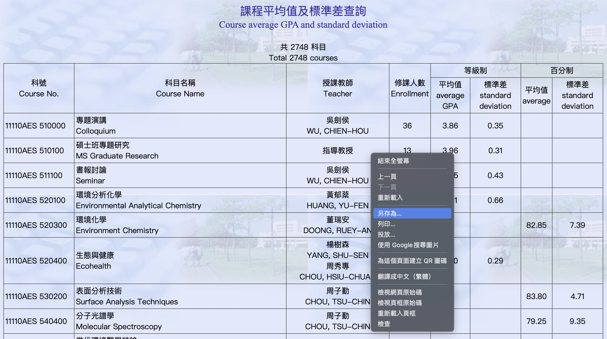
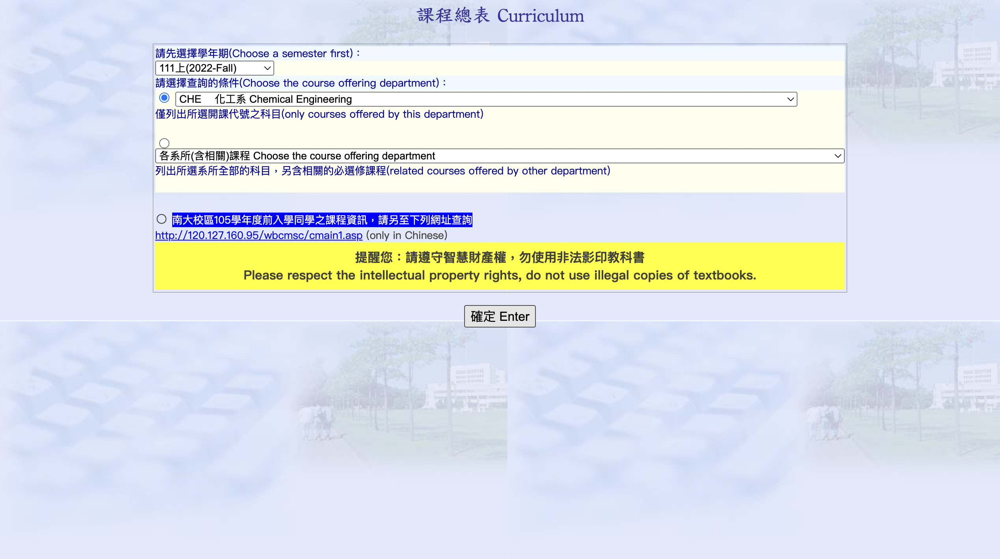
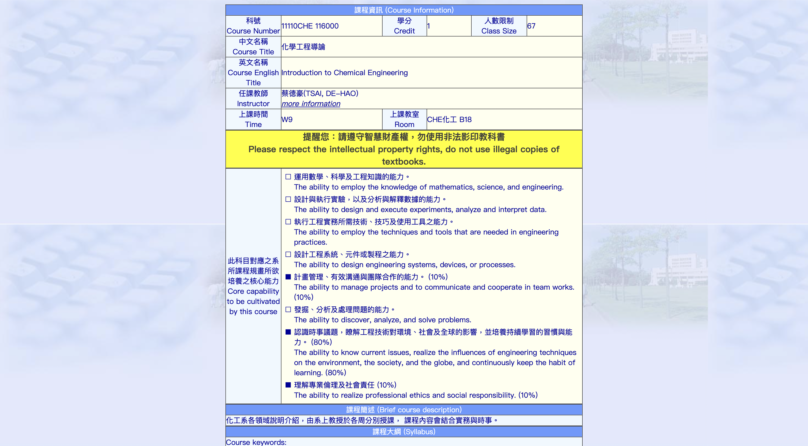
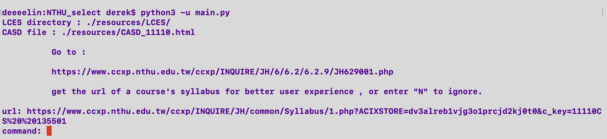
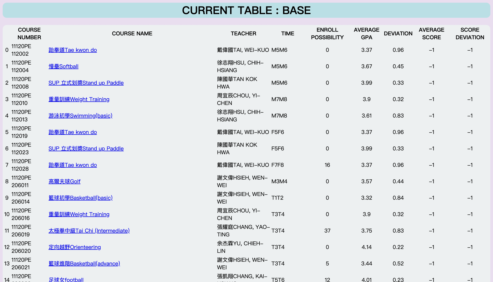
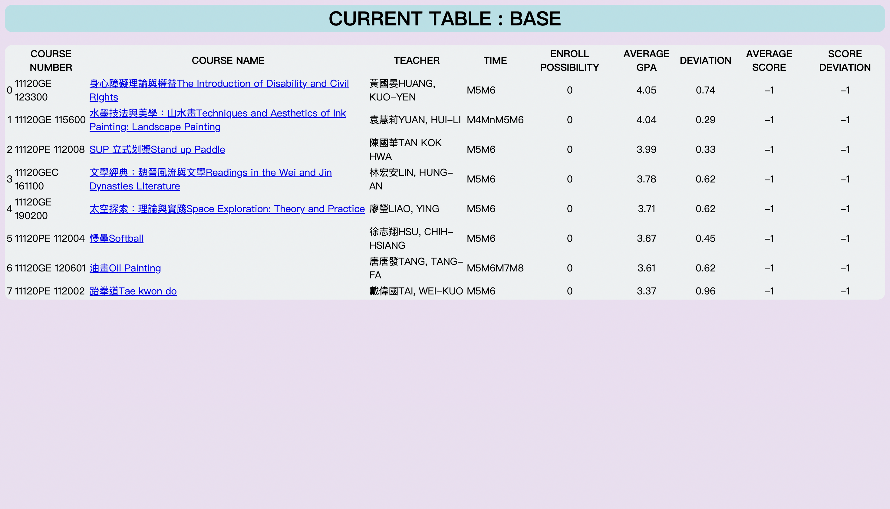

# **NTHU_SELECT**

## **Introduction** 

NTHU_SELECT is a tool that help NTHU students to analyze courses information and choose the most appropriate course .By entering python commands ,we can filter/sort courses in different ways , avoid selecting courses by intuition !

## **Motivation**

Being a sophomore in NTHU , jumping through webpages for consideration of selecting courses makes me feel very unconfortable.And this is why I come up with the idea of designing my own tool of selecting courses.At first, I expect marking a period after finishing the sorting functions , but I found joy while the project goes further , so further updates could occur at every second if I have time ...  

*Wish this tool helps you , ENJOY LEARNING !*


***

## **Requirements**

Before you begin, ensure you have met the following requirements:

* Having basic python understanding (For advanced usage)
* You have a machine that is able to execute python 
* You have installed all python extensions in requirements.txt
* You have read the instructions for using NTHU_SELECT

***

## **How to install NTHU_SELECT**

### To install NTHU_SELECT follow these steps:


1.
```
git clone https://github.com/deeeelin/NTHU_SELECT.git <folder path>
```

2.  Install required modules in requirements.txt

```
pip3 install -r <path of requirements.txt>
```

3.Go to the installed folder and execute main.py


***

## **How to use NTHU_SELECT**

*In this section,we use the sample html in "resources" folder for example demonstration step by step*


### Material gathering :

LCES : 

1. Download a department's LCES (Latest course enrollment status) html webpage using chrome , and save as "LCES":


2. Open the downloaded folder "LCES_files" and find the file named "xp03_m.html" , rename it : 


3. Put one or more LCES html (obtaiined on step 2) in a directory (like the sample directory "LCES" in "resources" folder )
 ,and enter the directory path to the program 


CASD: 

1. Go to CASD (Course average and Standard deviation webpage and just press "submit" :


2. Same as LCES ,download the CASD html using chrome save as "CASD":


3. Open the downloaded folder "CASD_files" and find the file named "xp03_m.html" , rename it: 


4. Enter the path of CASD file to the program

URL:

1. Go to curriculum webpage :

2. Click any course's syllabus and copy/paste it's url to the program:


**Sample terminal input by following above instructions :**




### Understanding course informations :

There are six information variable contained for each course :

* `num`-> course number 

* `name` -> course name 

* `teacher` -> course teacher

* `time` -> course time , in the form like  'R5R6' , 'T1T2T3' , etc.

* `possibility` -> possibility rate to enroll this course , ( 1 means 100% )

* `gpa` -> Average GPA of the course in previous semester

* `deviation` -> deviation of the course in previous semester


### **Analyzing** :


*At,first ,we list query result of courses on a default table called "BASE"*


**BASIC FUNCTIONS:**

* `list` : ```list <conditional expressions in python>``` -> list out courses that fits the conditional expression on current table

Example : 
``` 
list gpa>3
```
Result :



* `filter` : ```filter <conditional expressions in python>``` -> list out courses that fits the conditional expression by considering the courses on the table currently.

Example : 
``` 
filter 'M5M6' in time
```
Result :


* `sort` :

   ``` sort a <sort key/sort function>``` -> sort the courses in the table with the given sort function , in ascending order

   ``` sort d <sort key/sort function>``` -> sort the courses in the table with the given sort function , in descending order 

ps. For the usage of sort function ,see 'MAKING YOUR OWN FUNCTIONS' part below 

Example:
``` 
sort d gpa
```
Result :


* `remove` : ```remove <index1> <index2> ...``` -> remove a course from table by index (indexes are shown in the leftmost column of the table)

Example :
``` 
remove 3
```
Result :




* `reset` : ```reset``` -> reset the table (listing all courses)

Example :
``` 
reset
```
Result :


* `exit` : ```exit``` -> exit the program 

**MORE FUNCTIONS:**

* `unshow` : ```unshow <info1> <info2 ... ``` -> let the table unshow these informations 

Example :
``` 
unshow num deviation 
```
Result :


* `show` : ```show <info1> <info2> ... ``` -> let the table include these informations 

Example :
``` 
show deviation num
```
Result :


* `show_mode` : ```show_mode <html/text>``` -> let table result been shown in html format or text format

Example :
``` 
show_mode text
```
Result :


Example : 
```
show_mode html
```
Result :


* `renew_url` : ```renew_url``` -> if link of the course doesn't leads to syllabus,sign in to curriculum again and get the new syllabus url


**TABLE FUNCTIONS:**

* `add_table` : ```add_table <new table name> <inherit table name (optional) > ``` -> create a new table and switch to it , the new table can be a copy of other table by adding the additional parameter 

Example :
```
add_table table2
```

Result :
```
table added  !
```

* `change` : ```change <table name>``` -> switch to other table 

Example : 
```
change BASE
```

Result :

```
table changed !
```

* `delete_table` : ```delete_table <table name>  ``` -> delete table

Example : 
```
delete_table table2
```

Result :

```
table deleted !
```

**MAKING YOUR OWN FUNCTIONS:**
 

`function` : ```function <function(parameter)>``` -> users can define their own python analyzing function in extensions.py for individual usage ,make sure:

   * Briefly trace code of  objects.py to get more understanding of the program
      
   * The first parameter of every function needs to be "self" ,

   * For sorting function : return values  ex. return gpa ,return <numeric variables> ,etc.

   * For list/filter function : return list of 'course' object (please see class 'course' in objects.py)
      


Sample function in extension.py : (given a string of available time , find the possible courses to attend in that time  )


Example application :

``` 
function courses_in_available_time('R1R2R3R4T1T2T3T4')

```
Result :


 
***

## **View result :**
  
   * If the show mode is html ,then there will be a file called "result.html" produced in the same directory of NTHU_SELECT , you can look up the result by using Chrome browser or VS code extensions .
 
   * If the show mode is text,then there will be a file called  "result.txt" produced in the same directory of NTHU_SELECT 

***

## **Very welcome to make contributes to NTHU_SELECT**

To contribute to this project:

1. Fork this repository.
2. Create branch
3. Make changes and commit them
4. Push to your github
5. Create pull request.
6. Send a message to me via email

## **List of contributors**

* [@deeeelin](https://github.com/deeeelin) 

## **Contact me**

If you want to contact me you can reach me at <dereklin100503@gmail.com>

## **MIT License**

This project uses the following license: [MIT License](https://choosealicense.com/licenses/mit/#).

***
